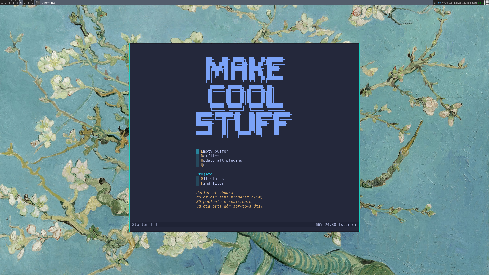

# Vi, vim e venci

[](http://neni.dev/emojicom)



Sugestão de primeira configuração amigável e eficiente, ideal para interessados em começar a usar [Neovim](https://neovim.io/). Extremamente inspirada no [kickstart.nvim](https://github.com/nvim-lua/kickstart.nvim), porém mais simples e com menos plugins.

## Pré-requisitos

- Neovim (talvez o [nightly](https://github.com/neovim/neovim/releases/tag/nightly) seja obrigatório por alguns plugins)
- `xclip`
- `ripgrep`

## Instalação

Abaixo você terá duas sugestões de instalação:

1. Primeira e única configuração do ambiente: caso você não tenha configurado e por ti tudo ok usar essa como base
2. Configuração paralela: caso você já possua uma, talvez até esteja montando aos poucos, e quer manter ambas

### 1. Configuração única

```sh
git clone https://github.com/nenitf/vi-vim-venci.git "${XDG_CONFIG_HOME:-$HOME/.config}"/nvim
nvim --headless -c 'autocmd User PackerComplete quitall' -c 'PackerSync'
```

### 2. Configuração paralela

```sh
git clone https://github.com/nenitf/vi-vim-venci.git "${XDG_CONFIG_HOME:-$HOME/.config}"/nvim-venci
echo "alias nvim-venci='NVIM_APPNAME=\"nvim-venci\" nvim'" >> ${XDG_CONFIG_HOME:-$HOME/.bashrc}
alias nvim-venci='NVIM_APPNAME="nvim-venci" nvim'
nvim-venci --headless -c 'autocmd User PackerComplete quitall' -c 'PackerSync'
```

> Sempre que for usar essa configuração, utilize `nvim-venci` no terminal ao invés de `nvim`

## Próximos passos

- Configure/pesquise sobre qual LSP você sente falta. Use `:Manson` caso não conheça, se ja sabe configure no `init.lua`, como o `intelephense`
- Crie/altere snippets
- Dê uma fuçadas nos atalhos em `vimrc` e no `init.lua`
- Aprenda sobre os plugins e experimente novos, incluindo colorscheme
- Modularize as configurações com `require` em mais de um arquivo
- Versione suas configurações!

## Fluxos sugeridos/configurados

- Salve o arquivo com `<space><space>`
- Pesquise arquivos no projeto com `<space>f`
    - Abra com `<enter>` no local do arquivo atual, ou `<ctrl>h`/`<ctrl>v` em janela dividida horizontal/verticalmente
- Pesquise arquivos que ja foram abertos a pouco tempo `<space>b`
- Navegue através de pastas com `<space>-`
    - Crie arquivos com `a`
    - Renomeie arquivos e pastas com `r`
    - Delete com `d`
    - Recorte com `x`
    - Feche com `q`
- Pesquise texto no projeto com `<ctrl>f` - crie um arquivo `.rgignore` no projeto caso queira ignorar alguns paths, semelhante ao gitignore
    - Utilize `<c-q>` para persistir temporariamente a pesquisa em uma lista fixa, feche a qualquer momento como um arquivo normal
- Após fazer uma pesquisa no arquivo com `/`, utilize `<space>/` para remover marcação visual
- Liste métodos com `<space>a`
- Abra uma nova aba com `<space>t`
- Divida a tela horizontalmente com `<space>h`
- Divida a tela verticalmente com `<space>v`
- Mova entre divisões com `<space>j` e `<space>k`
- Use `s` para facilitar a movimentação
- Idente o arquivo com `<space>=`
- Com LSP configurado: Use `gd`, `gr`, `<space>ca`, `K` e `KK` (para sair da janela de `KK` utilize `q`)
- Feche arquivos/buffers/tabs `<space>df`
- Mantenha somente um arquivo/buffer/tab `<space>ds`
- Comente/descomente código com `gcc`
- Use git com `<space>gg`
    - `=` diff
    - `-` stage/unstage em todo ou partes de um arquivo
        - Tambem é possível fazer push, mas o primeiro deve ser feito com `:G push ...` igual ao terminal
    - `cc` commit, dentro da mensagem `ZZ` para salvar e commitar ou `ZQ` para cancelar e fechar
    - `X` desfazer alteração de um arquivo ou de seleção
- Desfaça alterações com `u` ou `<ctrl>z` e refaça com `<ctrl>r`

## FAQ

- Como abro o projeto com o editor? Acesse a pasta dele pelo terminal e execute `nvim` ou `nvim-venci`, de acordo com a sua opção de instalação
- Como fecho um arquivo? Use `:q` para sair, `:q!` para sair sem salvar (caso haja alguma modificação não salva)
- Por que manter `vimrc`? Para configurações mais basicas que podem ser compativeis com o Vim, pois somente o Neovim lê configurações escritas em Lua
- Como atualizo as versões dos plugins? `:PackerSync`, tem atalho na tela inicial também
- Quebrei algo e ta dando tudo errado, o que eu faço para retornar o estado original? Apague a pasta que o projeto foi clonado (`~/.config/nvim` ou `~/.config/nvim-venci`) e siga novamente as instruções de instalação
- [Bug](https://github.com/LunarVim/LunarVim/issues/3680) `treesitter/query.lua:273: Query error at 9:4. Invalid node type "heredoc_end"`: execute `:TSInstall all` (é bem lento)
